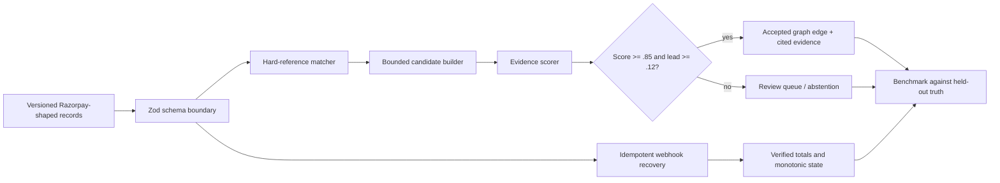
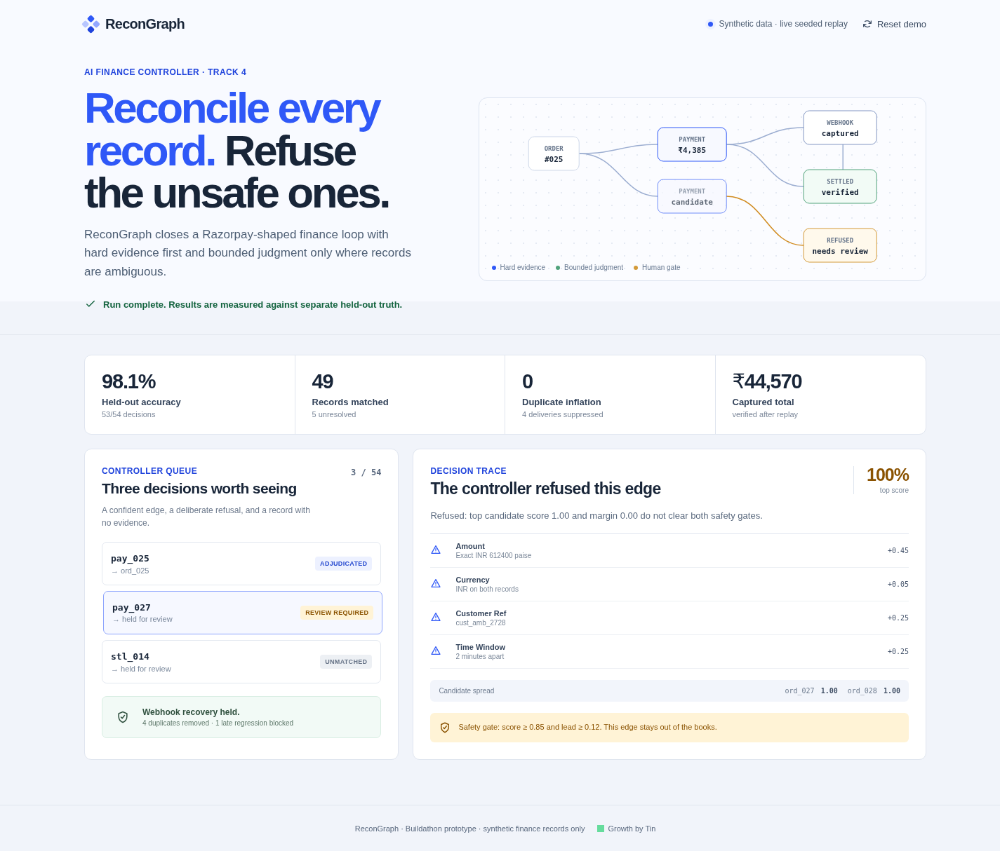

# ReconGraph

## Tagline

Reconcile every record. Refuse the unsafe ones.

ReconGraph is a deterministic AI finance-controller prototype for Razorpay AI Buildathon Track 4. It turns orders, payments, refunds, settlements, and webhook deliveries into an explainable reconciliation graph, while deliberately abstaining when evidence is tied or insufficient.

> Evidence label: all product data and benchmark traffic are **SIMULATED** and shown through a **LIVE SEEDED REPLAY**. No production Razorpay account, customer data, or external model is used.

## Problem

Finance operators often close a payment loop across several record types. Hard foreign keys solve most joins, but missing references, duplicate webhook deliveries, late events, and near-identical candidates make the final few decisions risky. A system that always guesses can silently put the wrong edge in the books.

## Solution

ReconGraph applies hard rules first, then limits judgment to a prevalidated candidate set. A match is accepted only when its score is at least `0.85` and its lead over the runner-up is at least `0.12`. Every accepted edge cites its evidence; every unsafe edge stays unresolved for human review.

## Innovation

The core idea is **use abstention as a finance-control feature**. ReconGraph separates candidate generation, evidence scoring, and an explicit safety gate. This makes the interesting behavior observable: one ambiguous payment is accepted with a defensible `0.20` lead, while a different payment with two perfect candidates is refused despite a `1.00` top score.

## Architecture

The app is a static React interface backed by a deterministic TypeScript reconciliation engine. Versioned input fixtures and separately stored ground truth keep generation and evaluation distinct. See [the architecture decision record](docs/ARCHITECTURE.md) and [threat model](docs/THREAT-MODEL.md).

## Architecture diagram

The diagram shows the validated path from synthetic records to either an evidence-backed edge or an explicit exception, plus a separate replay-safety path.



## Sponsor technology

The domain model follows Razorpay’s payment lifecycle: orders, payments, refunds, settlements, and webhook events. The current submission uses synthetic Razorpay-shaped records so judges can run it without keys or money movement. A production adapter is intentionally out of scope; it would verify Razorpay webhook signatures before converting events into this same bounded internal schema.

## Key features

- Hard foreign-key matching before any ambiguous judgment.
- Bounded evidence scoring with visible weights and candidate spread.
- A two-part safety gate that refuses tied or weak decisions.
- Webhook deduplication and monotonic state recovery for retries and late delivery.
- Initial, loading, success, empty, validation-error, offline, and reset states.
- A 127-record synthetic fixture and separate 54-decision ground truth.

## Setup instructions

Requirements: Node.js `22.12+` and npm.

```bash
npm ci
npm run check
npx playwright install chromium
npm run test:e2e
npm run dev
```

No environment values are required. `.env.example` documents that boundary. Exact dependency versions are pinned in `package-lock.json`.

## Demo instructions

1. Open the app and confirm the `Synthetic data · live seeded replay` label.
2. Select **Run seeded reconciliation**.
3. Read the measured result strip, then select `pay_025` to inspect an accepted ambiguous edge.
4. Select `pay_027` to see the controller refuse two tied candidates.
5. Select **Reset demo** to restore the known start state.

Checkpoint routes: `/?state=success`, `/?state=empty`, `/?state=error`, and `/?state=offline`. The full presenter script and fallback ladder are in [DEMO.md](DEMO.md).

## Screenshots



The current build is also captured in the workspace Assets tab as `recongraph-verify.png`.

## Technical challenges

The hardest choice was not the scoring formula; it was defining when the controller must stop. Exact amount and currency only create candidates. Customer reference and time proximity add bounded evidence. A separate margin gate prevents a high-scoring tie from becoming a false assertion. For webhook recovery, event IDs are idempotency keys and state transitions are monotonic, so duplicate or late deliveries cannot regress a captured payment.

## Impact

On the versioned synthetic fixture, ReconGraph processes **127 records**, makes **53 of 54 held-out decisions correctly (98.1%)**, matches **49**, leaves **5 unresolved**, suppresses **4 duplicate deliveries**, and blocks **1 out-of-order state regression**. Precision is **100%** on accepted matches. These are measured prototype results, not production performance claims; method and limitations are in [benchmarks/README.md](benchmarks/README.md).

## Future roadmap

- Add a signature-verifying Razorpay webhook adapter and encrypted event store.
- Learn score calibration from consented, de-identified operator decisions.
- Add maker-checker approval and an append-only audit export.
- Evaluate on larger, independently authored fixtures and real-world failure distributions.

## Team information

Built for Razorpay AI Buildathon Track 4. Student eligibility and final participant identity must be confirmed by the submitter before entry. See [SUBMISSION-CHECKLIST.md](SUBMISSION-CHECKLIST.md) for the remaining founder-owned gates.

## Verification

```bash
npm run lint       # Biome formatting and static checks
npm run typecheck  # TypeScript project build
npm test           # deterministic engine and adversarial input tests
npm run benchmark  # regenerate held-out metrics
npm run build      # production bundle
npm run test:e2e   # Chromium user-flow and responsive tests
```

## License

[MIT](LICENSE). All visible product graphics are original HTML, CSS, and inline SVG; there are no remote image, font, or model dependencies.
