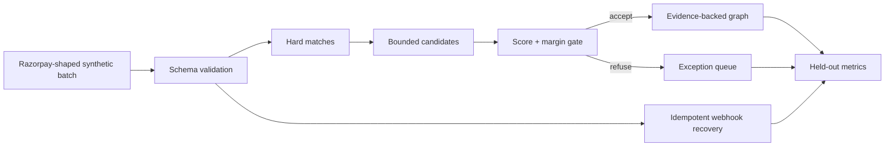

# Project title

ReconGraph

## Links

- Public repository: https://github.com/iamaanahmad/ReconGraph
- Permanent demo: https://iamaanahmad.github.io/ReconGraph/

## Tagline

Reconcile every record. Refuse the unsafe ones.

## Problem

Finance operators can join most payment records with direct IDs, but missing references, duplicate webhook retries, late events, and nearly identical candidates make the final exceptions dangerous. Guessing turns ambiguity into a bookkeeping error.

## Solution

ReconGraph closes one finance-ops loop across 127 synthetic orders, payments, refunds, settlements, and webhooks. Rules resolve certainty first. A bounded evidence scorer touches only ambiguous candidates, and a score-plus-margin gate decides whether to accept or abstain.

## Innovation

A high confidence score is not enough. ReconGraph also measures the lead over the runner-up. It accepts `pay_025` with a `0.20` margin, yet refuses `pay_027` even though both top candidates score `1.00`. The honest exception list is part of the output, not cleanup hidden after the demo.

## Architecture

The app is a static React UI around a deterministic TypeScript controller. Zod owns the input boundary, the matcher owns candidate/evidence policy, webhook recovery owns idempotency and monotonic state, and a separately stored ground-truth file owns evaluation. Details are in [docs/ARCHITECTURE.md](docs/ARCHITECTURE.md).

## Architecture diagram

The graph separates validation, deterministic matching, bounded adjudication, exception handling, replay safety, and independent measurement.

## Sponsor technology

Razorpay’s lifecycle is the organizing domain model: orders, payments, refunds, settlements, and webhook deliveries. This Track 4 build intentionally uses synthetic records and no production credentials. A future adapter would verify Razorpay signatures before conversion to the existing internal schema.

## Key features

- 127-record versioned synthetic batch.
- 98.1% exact held-out accuracy and 100% accepted-match precision.
- Explainable evidence weights and candidate comparisons.
- Explicit abstention on unsafe ties.
- Four duplicate deliveries suppressed and one late regression blocked.
- Initial, loading, success, empty, error, offline, and reset states.

## Setup instructions

With Node.js 22: run `npm ci`, `npm run check`, `npx playwright install chromium`, and `npm run test:e2e`. Start locally with `npm run dev`. No secret or account is required.

## Demo instructions

Open the [permanent demo](https://iamaanahmad.github.io/ReconGraph/), run the seeded reconciliation, select `pay_025` for the accepted ambiguous edge, then select `pay_027` for the deliberate refusal. Use **Reset demo** to restore the start. Full cues and fallbacks are in [DEMO.md](DEMO.md).

## Screenshots

## Technical challenges

Naive webhook replay counted every delivery and allowed late state to overwrite newer state. ReconGraph deduplicates by event ID and enforces monotonic transitions. Separately, a score-only matcher accepted unsafe ties; adding a runner-up margin gate created a measurable stopping rule.

## Impact

Measured on the versioned synthetic fixture: 53/54 decisions correct, 49 matched, five unresolved, four duplicate deliveries suppressed, and one late regression prevented. These are prototype benchmark results, not production claims. See [benchmarks/README.md](benchmarks/README.md).

## Future roadmap

Add signed Razorpay ingestion, tenant authorization, encrypted and append-only audit storage, maker-checker approval, threshold calibration, and larger independently authored evaluations.

## Team information

The submitter must add their name, college, graduation year, internship availability, and contribution details in the official form. Eligibility is a submission gate and is not inferred by this repository.
