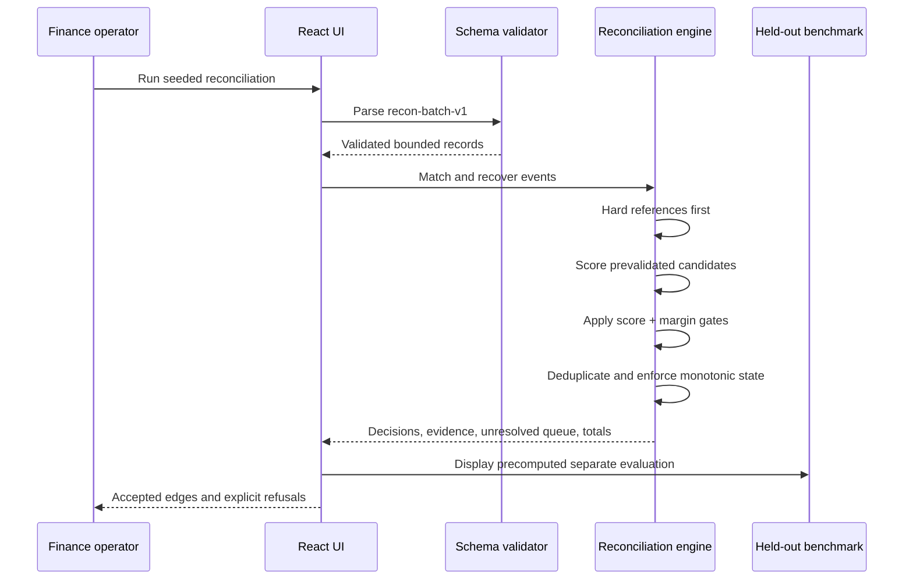

# Architecture

## System boundary

ReconGraph is an offline-first, single-user prototype. Its trusted input is a versioned JSON batch that passes the Zod schema. Its output is a set of match decisions plus recovered webhook state. It does not mutate payment-provider records, transfer money, call an external model, or persist customer data.

## Decision contract

1. A valid direct foreign key produces a hard match.
2. Otherwise, only orders with exact amount, currency, and a 24-hour window enter the candidate set.
3. Evidence weights are fixed: amount `0.45`, currency `0.05`, customer reference `0.25`, and time proximity up to `0.25`.
4. The best candidate must score at least `0.85` and lead the runner-up by at least `0.12`.
5. If either gate fails, the controller returns `review_required` or `unmatched`; it never fabricates a target.

## Data integrity

- Webhook `eventId` is the idempotency key.
- Events are processed by receipt time to reproduce real delivery disorder.
- Payment state is monotonic: `authorized < captured`; a late lower-rank event is recorded as a prevented regression.
- Captured totals count only the first unique capture event.
- The benchmark ground truth lives in `benchmarks/ground-truth.v1.json`, outside the product fixture and runtime code.

## Failure boundaries

Malformed IDs, dates, record counts, currencies, amounts, and enums fail at the schema boundary. Because the demo has no external API dependency, network loss degrades to a clearly labeled offline state without changing the result. An unknown or tied relationship stays outside the books.

## Production delta

A production design would add signed Razorpay webhook ingestion, tenant-scoped authorization, encrypted persistence, audit retention, an approval workflow, monitoring, backfills, and independently calibrated thresholds. None of those controls are claimed by this prototype.

